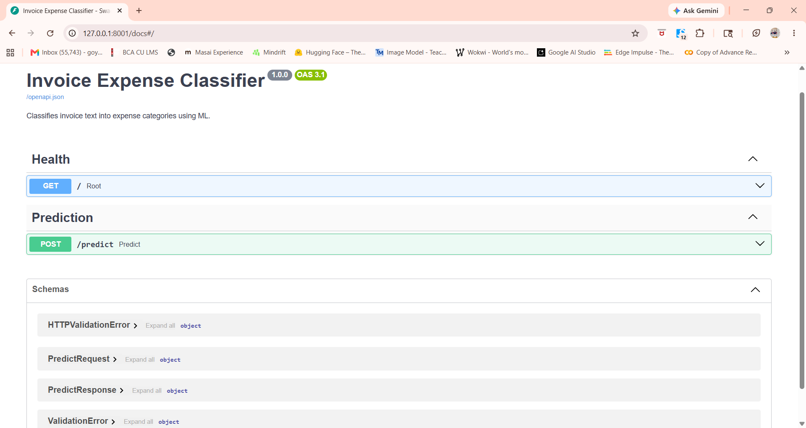
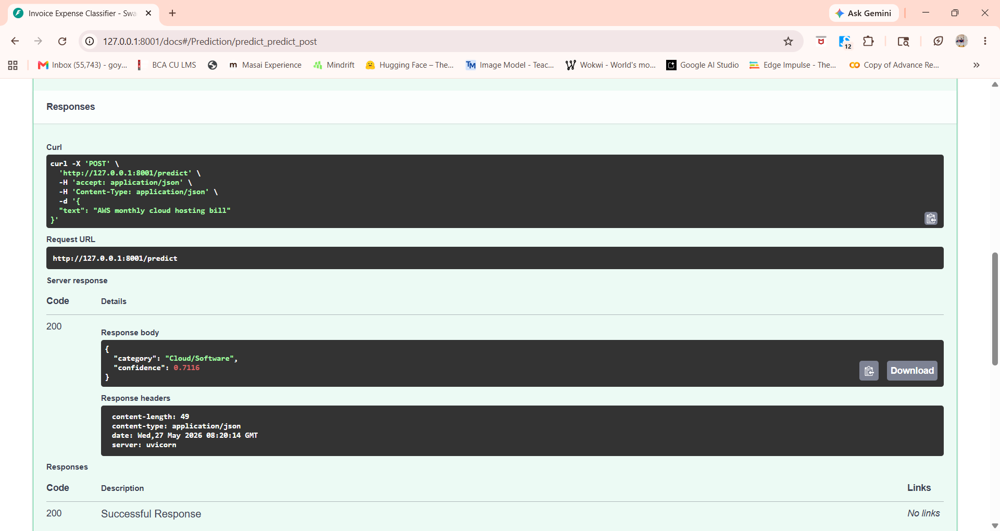

# Invoice Expense Classifier

A lightweight ML-powered REST API that classifies invoice text into expense categories using Natural Language Processing (NLP) and Machine Learning.

Built with:

- FastAPI
- scikit-learn
- TF-IDF Vectorization
- Logistic Regression
- Docker
- pytest

---

# Features

- Invoice expense category prediction
- Confidence score support
- FastAPI REST API
- TF-IDF + Logistic Regression pipeline
- Text preprocessing
- Docker support
- Unit tests with pytest
- Swagger API documentation
- Clean and lightweight architecture

---

# Supported Categories

| Category | Example |
|---|---|
| Logistics | "Blue Dart courier charges for warehouse delivery" |
| Office Supplies | "Printer paper and toner cartridges purchase" |
| Cloud/Software | "AWS monthly cloud hosting bill" |
| Utilities | "Electricity bill for office building" |
| Travel | "Flight booking for client meeting" |
| Inventory | "Raw material purchase for manufacturing" |

---

# Project Structure

```text
NextBill/
│
├── app/
│   ├── preprocessor.py
│   └── __init__.py
│
├── data/
│   └── invoices.csv
│
├── model/
│   └── model.pkl
│
├── tests/
│   ├── test_app.py
│   └── __init__.py
│
├── .pytest_cache/
├── __pycache__/
├── venv/
│
├── main.py
├── train.py
├── requirements.txt
├── Dockerfile
├── README.md
├── .gitignore
```

---

# Machine Learning Pipeline

The application follows a simple NLP + ML workflow:

1. Text preprocessing
2. TF-IDF vectorization
3. Logistic Regression classification
4. Confidence score generation

---

# Preprocessing Steps

Invoice text is cleaned before training and prediction:

- Convert text to lowercase
- Remove special characters
- Normalize whitespace

Example:

```python
"AWS Monthly CLOUD Bill!!!"
```

Becomes:

```python
"aws monthly cloud bill"
```

---

# Model Details

| Component | Technology |
|---|---|
| Vectorizer | TF-IDF |
| Classifier | Logistic Regression |
| Serialization | joblib |
| Language | Python 3.11 |

---

# Installation

## 1. Clone Repository

```bash
git clone https://github.com/your-username/invoice-expense-classifier.git

cd invoice-expense-classifier
```

---

## 2. Create Virtual Environment

### Windows

```bash
python -m venv venv

venv\Scripts\activate
```

### macOS/Linux

```bash
python3 -m venv venv

source venv/bin/activate
```

---

## 3. Install Dependencies

```bash
pip install -r requirements.txt
```

---

# Requirements

Main dependencies:

```txt
fastapi
uvicorn
scikit-learn
pandas
joblib
pytest
httpx
```

---

# Training the Model

Run the training pipeline:

```bash
python train.py
```

Expected output:

```text
Loading data...
Training on 96 samples, evaluating on 24 samples.

Classification Report:
...

Model saved to model/model.pkl
```

---

# Running the API

Start FastAPI server:

```bash
uvicorn main:app --reload
```

Server runs on:

```text
http://127.0.0.1:8000
```

---

# Swagger API Documentation

Interactive API documentation:

```text
http://127.0.0.1:8000/docs
```

Alternative ReDoc documentation:

```text
http://127.0.0.1:8000/redoc
```

---

# API Endpoints

---

## Health Check

### Request

```http
GET /
```

### Response

```json
{
  "status": "ok",
  "message": "Invoice Expense Classifier is running."
}
```

---

## Predict Expense Category

### Request

```http
POST /predict
```

### Request Body

```json
{
  "text": "AWS monthly cloud hosting bill"
}
```

### Response

```json
{
  "category": "Cloud/Software",
  "confidence": 0.9821
}
```

---

# Sample API Requests

## Cloud/Software

```bash
curl -X POST http://localhost:8000/predict \
-H "Content-Type: application/json" \
-d '{"text":"AWS monthly cloud hosting bill"}'
```

---

## Logistics

```bash
curl -X POST http://localhost:8000/predict \
-H "Content-Type: application/json" \
-d '{"text":"Blue Dart courier delivery charges"}'
```

---

## Travel

```bash
curl -X POST http://localhost:8000/predict \
-H "Content-Type: application/json" \
-d '{"text":"Flight booking for client meeting"}'
```

---

# Running Unit Tests

Execute tests using pytest:

```bash
pytest tests/ -v
```

Tests included:

- Preprocessing validation
- API endpoint testing
- Confidence score testing
- Health check testing
- Empty request validation

---

# Docker Setup

## Build Docker Image

```bash
docker build -t invoice-classifier .
```

---

## Run Docker Container

```bash
docker run -p 8000:8000 invoice-classifier
```

API becomes available at:

```text
http://localhost:8000
```

---

# Confidence Score

The API returns prediction confidence using model probabilities.

Example:

```json
{
  "category": "Travel",
  "confidence": 0.9472
}
```

Confidence is generated using:

```python
predict_proba()
```

from Logistic Regression.

---

# Screenshot Section

## Swagger UI

> 


```md

```

---

## API Prediction Example

> 


```md

```

---


---

# Example Predictions

| Invoice Text | Predicted Category |
|---|---|
| AWS cloud hosting bill | Cloud/Software |
| Electricity bill for office | Utilities |
| Flight booking for business meeting | Travel |
| Blue Dart courier charges | Logistics |
| Office printer paper purchase | Office Supplies |
| Manufacturing raw materials | Inventory |

---

# Future Improvements

Possible future enhancements:

- Larger training dataset
- Model versioning
- Database integration
- Authentication
- CI/CD pipeline
- Advanced NLP models
- Deployment to cloud platforms

---

# Tech Stack

| Layer | Technology |
|---|---|
| Backend | FastAPI |
| Machine Learning | scikit-learn |
| NLP | TF-IDF |
| Model | Logistic Regression |
| Testing | pytest |
| Containerization | Docker |

---

# Author

Hrithik Kumar

---

# License

This project is for educational and assessment purposes.
